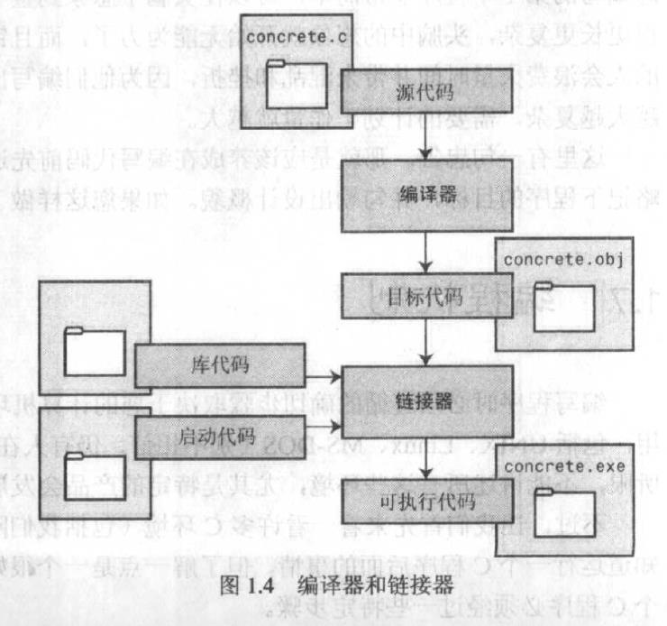

# C语言基础概念

## 1.编程机制

### 1.1编译器和链接器

源代码--------->（编译器）------ 目标代码---------------（链接器）---------------可执行文件

目标代码 + 库代码 + 启动代码  ----->可执行文件

	

### 1.2编译代码


- UNIX :   cc   xxx.c
- LINUX:   gcc xxx.c

编译后生成a.out，可以直接执行，重命名并保存该文件方便下次执行。

### 1.3语言标准
- C90/ANSI C
- C99

### 1.4数值类型

#### 1.4.1 int
进制： 
- 0x 0X（16进制）：0x00
- 0（8进制）：020

打印：

```
int i = 32767;
float f = 1.4;
i++;
printf("i=%d,f=%f",i,f);
```