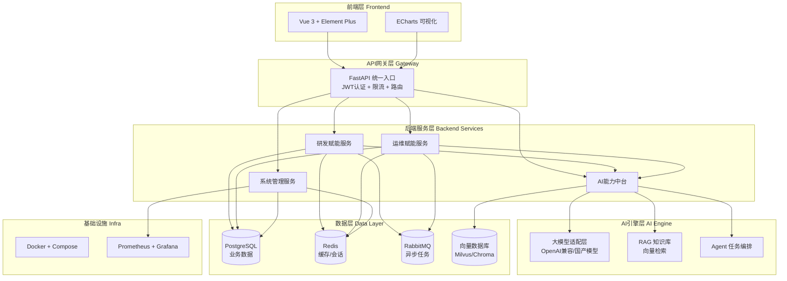

# AI赋能研发运维辅助系统

以大语言模型（LLM）为核心引擎，打通研发（Dev）与运维（Ops）全链路，提供智能化的代码审查、测试生成、监控告警、日志分析、故障自愈等能力。

## 一、项目定位与核心价值

**定位**：前后端分离的 AI 研发运维辅助平台，前端 Vue 3，后端 Python FastAPI。

**核心价值**：

- **AI驱动**：将 LLM 能力嵌入研发运维各环节，减少人工重复劳动
- **DevOps闭环**：研发 → 测试 → 部署 → 监控 → 反馈 全链路贯通
- **数据驱动决策**：可视化研发效能与系统健康度
- **主动防御**：从被动告警转向智能预测与自愈

## 二、系统整体架构



## 三、功能模块规划

### 3.1 研发赋能模块（Dev）

| 子模块 | 功能描述 | AI能力 |
|--------|----------|--------|
| AI代码审查 | 提交代码自动审查，识别Bug、安全漏洞、规范问题 | LLM代码理解 + 规则引擎 |
| 智能测试生成 | 为函数/接口自动生成单元测试用例 | LLM + 代码AST分析 |
| 文档自动生成 | 根据代码生成API文档、README、变更说明 | LLM摘要生成 |
| 研发效能看板 | 代码提交量、构建成功率、发布频率统计 | 数据聚合 + 趋势预测 |
| 智能问答助手 | 基于代码仓库的自然语言问答 | RAG + 代码索引 |

### 3.2 运维赋能模块（Ops）

| 子模块 | 功能描述 | AI能力 |
|--------|----------|--------|
| 智能监控告警 | 指标异常检测、告警降噪、根因分析 | LLM + 时序异常检测 |
| 日志智能分析 | 日志聚类、异常提取、错误模式识别 | LLM + 日志模式匹配 |
| 故障自愈 | 告警触发自动执行修复脚本/重启服务 | Agent + 预设Playbook |
| 运维知识库 | 故障案例库、解决方案智能检索 | RAG向量检索 |
| 变更管理 | 发布审批、变更影响分析、一键回滚 | 流程引擎 |

### 3.3 AI能力中台

| 子模块 | 功能描述 |
|--------|----------|
| 大模型管理 | 多模型接入、路由、调用统计、成本控制 |
| Prompt工程 | Prompt模板管理、版本控制、A/B测试 |
| 知识库/RAG | 文档上传、向量化、检索增强生成 |
| Agent编排 | 多步骤任务编排、工具调用、记忆管理 |

### 3.4 系统管理模块

- 用户管理 + RBAC权限控制
- 系统配置中心
- 操作审计日志
- 系统健康监控

## 四、技术栈选型

### 前端

| 技术 | 版本 | 用途 |
|------|------|------|
| Vue | 3.4+ | 核心框架 |
| TypeScript | 5.x | 类型安全 |
| Vite | 5.x | 构建工具 |
| Element Plus | 2.x | UI组件库 |
| Pinia | 2.x | 状态管理 |
| Vue Router | 4.x | 路由 |
| Axios | 1.x | HTTP请求 |
| ECharts | 5.x | 图表可视化 |
| Monaco Editor | - | 代码展示/编辑 |
| ESLint + Prettier | - | 代码规范 |

### 后端

| 技术 | 版本 | 用途 |
|------|------|------|
| Python | 3.11+ | 运行时 |
| FastAPI | 0.110+ | Web框架 |
| SQLAlchemy | 2.x | ORM |
| Pydantic | 2.x | 数据校验 |
| Alembic | - | 数据库迁移 |
| Celery | 5.x | 异步任务 |
| LangChain / LangGraph | - | LLM编排 |
| psutil | - | 系统监控 |
| python-jose | - | JWT认证 |
| passlib | - | 密码加密 |

### 数据与中间件

| 技术 | 用途 |
|------|------|
| PostgreSQL 15+ | 主数据库 |
| Redis 7+ | 缓存、会话、限流 |
| RabbitMQ | 消息队列（Celery broker） |
| Milvus / Chroma | 向量数据库（RAG） |
| Prometheus + Grafana | 系统监控 |

## 五、目录结构设计

> 初始脚手架保持精简，以下为当前实际结构；后续按需扩展（views 子目录、alembic、tests、tasks 等随功能开发逐步加入）。

```
aidevops/
├── frontend/                    # 前端项目（Vue 3 + Vite + TS）
│   ├── public/                  # 公共静态资源
│   ├── src/
│   │   ├── api/                 # API接口封装
│   │   ├── assets/              # 静态资源
│   │   ├── components/          # 通用组件
│   │   ├── views/               # 页面视图
│   │   ├── router/              # 路由配置
│   │   ├── stores/              # Pinia状态
│   │   ├── utils/               # 工具函数
│   │   ├── App.vue              # 根布局
│   │   ├── env.d.ts             # 类型声明
│   │   └── main.ts              # 应用入口
│   ├── index.html
│   ├── package.json
│   ├── tsconfig.json
│   └── vite.config.ts           # 含 /api 代理到后端 8000 端口
│
├── backend/                     # 后端项目（FastAPI）
│   ├── app/
│   │   ├── api/v1/              # API路由层（router.py 聚合）
│   │   ├── core/                # 核心配置（config.py）
│   │   ├── models/              # 数据模型
│   │   ├── schemas/             # Pydantic模式
│   │   ├── services/            # 业务逻辑层
│   │   ├── ai/                  # AI能力层（llm/rag/agents 后续扩展）
│   │   └── main.py              # 应用入口（CORS + 路由注册）
│   ├── requirements.txt
│   └── .gitignore
│
├── docker/                      # Docker配置（后续补充）
├── docs/                        # 项目文档
└── README.md
```

### 启动方式

```bash
# 后端（端口 8000）
cd backend
python -m venv .venv && source .venv/bin/activate
pip install -r requirements.txt
uvicorn app.main:app --reload

# 前端（端口 5173，/api 自动代理到后端）
cd frontend
npm install
npm run dev
```

## 六、数据库设计概要

| 表名 | 说明 | 关键字段 |
|------|------|----------|
| users | 用户表 | id, username, email, password_hash, role |
| roles | 角色表 | id, name, permissions(JSON) |
| code_reviews | 代码审查记录 | id, repo, branch, commit, status, ai_suggestions |
| test_cases | 生成的测试用例 | id, target_file, content, status |
| alerts | 告警记录 | id, metric, level, message, status, root_cause |
| logs | 日志分析记录 | id, source, pattern, anomaly_score |
| incidents | 故障事件 | id, title, severity, status, solution |
| knowledge_docs | 知识库文档 | id, title, content, vector_id |
| llm_models | 模型配置 | id, name, provider, api_key, base_url |
| prompt_templates | Prompt模板 | id, name, content, version |
| audit_logs | 审计日志 | id, user_id, action, detail, created_at |

## 七、开发计划与里程碑

分4个阶段迭代开发：

### 阶段一：基础框架搭建（2周）
- 前后端脚手架、Docker环境
- 用户认证、RBAC权限
- 数据库设计与迁移
- 统一响应格式、异常处理、日志

### 阶段二：核心AI能力（3周）
- 大模型适配层（多模型接入）
- Prompt模板管理
- RAG知识库基础
- AI代码审查MVP

### 阶段三：研发+运维功能（4周）
- 智能测试生成、文档生成
- 监控告警接入、日志分析
- 故障自愈Playbook
- 研发效能看板

### 阶段四：优化与上线（2周）
- 性能优化、缓存策略
- 权限细化、审计完善
- 系统监控、告警通知
- 部署文档、用户培训

## 八、关键技术风险与应对

| 风险 | 应对措施 |
|------|----------|
| 大模型API成本高 | 模型路由+结果缓存，支持国产模型/本地模型 |
| AI输出不稳定 | Prompt工程 + 结构化输出(JSON Schema) + 结果校验重试 |
| RAG检索质量 | 分块策略优化 + 重排序(Rerank) + 多轮检索 |
| 数据安全合规 | 敏感信息脱敏、API密钥加密存储、操作审计 |
| 前后端联调 | 统一接口规范(OpenAPI) + Mock数据 + 契约测试 |
| 异步任务可靠性 | Celery任务结果持久化 + 失败重试 + 死信队列 |
| 系统性能 | Redis缓存热点数据 + 数据库索引 + 异步非阻塞 + 分页查询 |

## 九、实施路线

1. **确认方案**：评审架构与功能模块，确认优先级
2. **环境准备**：Docker、Python 3.11+、Node 18+
3. **脚手架搭建**：初始化前后端项目骨架
4. **数据库建模**：完善表结构与迁移脚本
5. **AI能力验证**：先跑通 LLM调用 + RAG 的最小闭环
