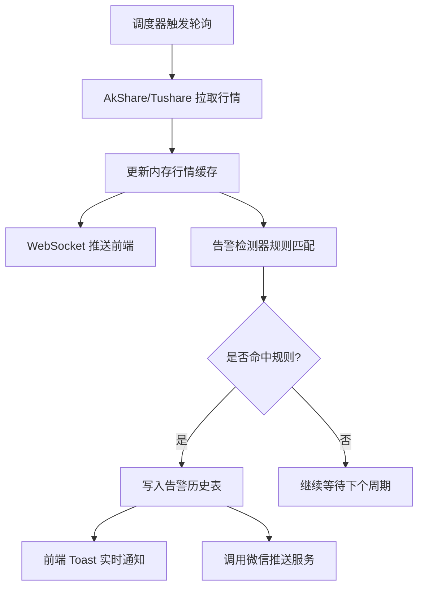

# 股票助手 - 产品需求文档（PRD）

## 1. 产品概述

股票助手是一款面向个人 A 股投资者的实时行情监控与智能告警平台。通过后端调度器在交易时段内秒级采集行情数据，自动检测涨跌幅、短时涨速、成交量异动、技术指标突破四类信号，第一时间将"大涨大跌"信号经微信推送给用户，并提供可视化看板与历史回溯，帮助用户盘中无需盯盘也能不错过关键交易时机。产品按阶段迭代，首期聚焦"实时行情监控 + 自选股管理"，后续逐步接入异常检测、智能通知、AI 分析。

- 目标用户：A 股个人投资者（长线/短线交易者）
- 核心价值：盘中无需盯盘，关键异动发生时秒级收到通知
- 商业价值：提升交易决策时效性，降低盯盘成本

## 2. 核心功能

### 2.1 用户角色

| 角色 | 注册方式 | 核心权限 |
|------|---------|---------|
| 个人用户 | 本地账号（首次启动自动创建） | 管理自选股、配置告警规则、查看行情与告警、配置推送渠道 |

> 单用户本地部署优先，不强制多租户。

### 2.2 功能模块

1. **仪表盘**：实时行情概览、今日告警摘要、市场速览
2. **自选股管理**：添加/删除/分组/编辑监控股票
3. **告警规则**：涨跌幅阈值、短时涨速、成交量异动、技术指标突破四类规则配置
4. **告警历史**：历史告警记录检索与详情回溯
5. **设置**：微信推送配置、数据源配置、监控调度参数

### 2.3 页面详情

| 页面名称 | 模块名称 | 功能描述 |
|---------|---------|---------|
| 仪表盘 | 实时行情卡片 | 展示自选股最新价、涨跌幅、涨速、成交量，WebSocket 秒级推送 |
| 仪表盘 | 今日告警摘要 | 列出当日已触发告警，按时间倒序 |
| 仪表盘 | 市场速览 | 上证、深证、创业板、科创50 等大盘指数实时行情 |
| 自选股管理 | 股票列表 | 表格展示自选股，支持搜索、分组折叠、批量操作 |
| 自选股管理 | 添加股票 | 按代码/名称搜索并添加，支持模糊匹配 |
| 告警规则 | 规则列表 | 已配置规则卡片，支持启用/禁用/编辑/复制 |
| 告警规则 | 规则编辑器 | 表单配置：股票范围、信号类型、参数阈值、生效时段、推送渠道 |
| 告警历史 | 告警流水 | 时间轴/表格展示历史告警，支持按股票/规则/时间筛选 |
| 告警历史 | 详情回溯 | 展示告警时刻的行情快照（K 线、量价、指标值） |
| 设置 | 推送渠道 | Server酱/PushPlus Token 配置与测试推送 |
| 设置 | 数据源与调度 | AkShare/Tushare 切换、轮询频率、盘中时段配置 |

## 3. 核心流程

### 3.1 实时监控与告警主流程

用户启动应用后，后端调度器在交易时段内按设定频率轮询行情数据源，将最新行情通过 WebSocket 推送到前端仪表盘；同时告警检测器对每条新行情执行规则匹配，命中规则时落库告警记录、即时推送前端通知、调用微信推送服务。

### 3.2 自选股添加流程

用户在自选股页输入代码或名称 → 前端模糊搜索本地股票库 → 选中后调用接口写入自选股表 → 调度器自动将该股加入下一轮轮询 → 仪表盘实时展示。

## 4. 用户界面设计

### 4.1 设计风格

- **主色调**：深色金融主题——主背景 `#0B0E11`（近黑），次级面板 `#161A1F`，强调色 `#F0B90B`（金黄），涨红 `#F6465D`（A 股红涨），跌绿 `#16C784`
- **按钮**：扁平圆角（4px），主按钮金底黑字，次按钮描边
- **字体**：数据展示用 JetBrains Mono 等宽字体（行情数字对齐），标题/正文用 HarmonyOS Sans SC
- **布局**：左侧固定导航栏 + 右侧主内容区，卡片栅格，数据密集表格
- **图标**：线性图标（lucide-react），涨跌用上下三角箭头
- **动效**：行情数字变化时短暂高亮闪烁（涨红/跌绿），告警 Toast 从右侧滑入

### 4.2 页面设计概览

| 页面名称 | 模块名称 | UI 元素 |
|---------|---------|---------|
| 仪表盘 | 实时行情卡片 | 深色卡片栅格，每卡含股票名/代码/最新价/涨跌幅/涨速/成交量，数字等宽对齐，涨跌闪烁动效 |
| 仪表盘 | 今日告警摘要 | 右侧侧栏卡片列表，告警项含信号类型标签（涨跌幅/涨速/量能/技术）、时间、触发值 |
| 仪表盘 | 市场速览 | 顶部横向指数条，展示上证/深证/创业板/科创50 实时点位与涨跌 |
| 自选股管理 | 股票列表 | 深色数据表格，支持分组折叠、行内操作（删除/编辑规则）、批量选择 |
| 自选股管理 | 添加股票 | 顶部搜索框，下拉模糊匹配候选，Enter 添加 |
| 告警规则 | 规则列表 | 卡片网格，每卡显示规则名/类型/状态开关/命中率 |
| 告警规则 | 规则编辑器 | 抽屉式表单，分信号类型 Tab，参数滑块/输入混合 |
| 告警历史 | 告警流水 | 双栏：左侧时间轴，右侧详情 |
| 告警历史 | 详情回溯 | K 线图（lightweight-charts）+ 触发时刻标注线 + 指标叠加 |
| 设置 | 推送渠道 | 表单 + 测试推送按钮，状态徽章 |
| 设置 | 数据源与调度 | 单选切换数据源，数字步进器配置轮询频率 |

### 4.3 响应式

- Desktop-first（1440px+ 优化）
- 平板（768-1280px）：导航栏折叠为图标条，卡片栅格自适应列数
- 移动端（<768px）：单列堆叠，底部 Tab 导航，告警 Toast 全宽

### 4.4 3D 场景指引

不适用（本产品无 3D 场景需求）。

## 5. 分阶段实施计划

| 阶段 | 范围 | 关键交付 |
|------|------|---------|
| **P1 实时行情监控**（先做） | 前端骨架 + 行情采集 + WebSocket 推送 + 自选股管理 + 大盘指数 | 仪表盘秒级看行情，自选股增删改，市场速览 |
| P2 异常检测 + 智能通知 | 四类告警规则引擎 + Server酱微信推送 + 告警历史 | 涨跌/涨速/量能/指标触发告警并微信推送 |
| P3 AI 分析 | 接入 LLM，对告警进行解读、给出操作建议 | 告警详情含 AI 解读卡片 |
