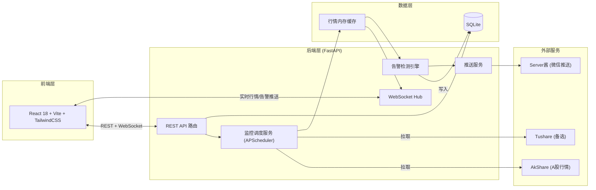
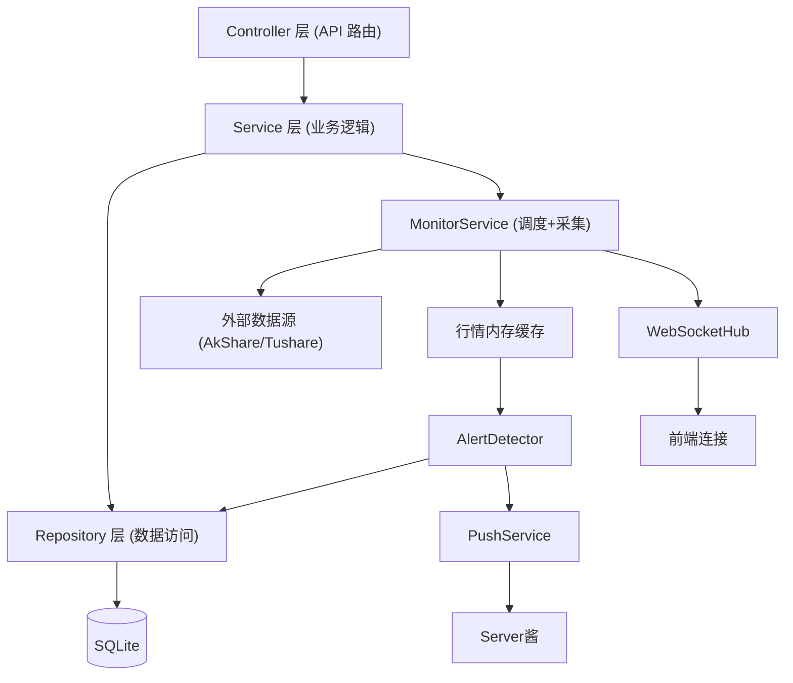
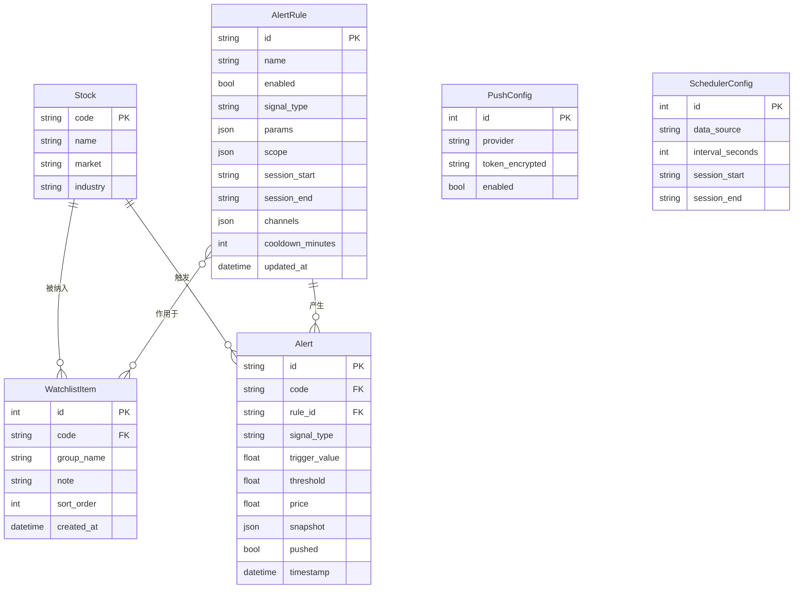

# 股票助手 - 技术架构文档

## 1. 架构设计



**关键说明**：前后端分离部署。前端为 SPA，由 Vite 构建后可由 FastAPI 静态托管或独立 Nginx 托管；后端为单体 FastAPI 服务，承载 REST API、WebSocket、调度器、检测引擎、推送服务。SQLite 单文件存储元数据与告警历史，行情实时数据驻留进程内存缓存以降低延迟。

## 2. 技术说明

### 2.1 前端

- **框架**：React 18 + TypeScript + Vite
- **样式**：TailwindCSS 3
- **状态管理**：Zustand（轻量，适合实时数据流）
- **路由**：React Router v6
- **图表**：lightweight-charts（TradingView K 线）+ recharts（指标曲线）
- **实时通信**：原生 WebSocket + 自动重连封装
- **UI 组件**：自研 + lucide-react 图标
- **初始化工具**：`npm create vite@latest frontend -- --template react-ts`

### 2.2 后端

- **语言/框架**：Python 3.11 + FastAPI + Uvicorn
- **任务调度**：APScheduler（AsyncIOScheduler，进程内）
- **数据采集**：AkShare（主，免费 A 股实时行情）+ Tushare（备，需 Token）
- **HTTP 客户端**：httpx（异步，调用 Server酱 / Tushare）
- **WebSocket**：FastAPI 原生 WebSocket 支持
- **加密**：cryptography（Token 加密存储）
- **配置**：pydantic-settings（环境变量 + .env）

### 2.3 数据库

- **数据库**：SQLite（单文件，零运维，适合个人部署）
- **ORM**：SQLAlchemy 2.0（异步引擎 + async_sessionmaker）
- **迁移**：Alembic

### 2.4 缓存

- **行情缓存**：进程内 `dict[code, Quote]` + 环形缓冲区（保留最近 N 条用于涨速计算）
- **告警冷却**：进程内 `dict[(rule_id, code), last_trigger_time]`
- **多实例时**：可选 Redis 替换进程内缓存

### 2.5 包管理

- 前端：npm
- 后端：uv（推荐）或 pip + requirements.txt

## 3. 路由定义

### 3.1 前端路由

| 路由 | 用途 |
|------|------|
| `/` | 仪表盘（实时行情 + 今日告警 + 市场速览） |
| `/watchlist` | 自选股管理 |
| `/rules` | 告警规则配置 |
| `/history` | 告警历史 |
| `/settings` | 系统设置 |

### 3.2 后端 REST API

| 方法 | 路径 | 用途 | 阶段 |
|------|------|------|------|
| GET | `/api/quotes/realtime` | 获取自选股最新行情快照 | P1 |
| GET | `/api/indexes/realtime` | 大盘指数实时行情 | P1 |
| WS | `/ws/quotes` | 订阅实时行情推送 | P1 |
| GET | `/api/watchlist` | 获取自选股列表 | P1 |
| POST | `/api/watchlist` | 添加自选股 | P1 |
| DELETE | `/api/watchlist/{code}` | 删除自选股 | P1 |
| PUT | `/api/watchlist/{code}` | 编辑自选股（分组/备注） | P1 |
| GET | `/api/stocks/search?q=` | 股票模糊搜索 | P1 |
| GET | `/api/system/status` | 系统状态（数据源连通性、调度状态） | P1 |
| WS | `/ws/alerts` | 订阅实时告警推送 | P2 |
| GET | `/api/rules` | 获取告警规则列表 | P2 |
| POST | `/api/rules` | 创建告警规则 | P2 |
| PUT | `/api/rules/{id}` | 更新规则 | P2 |
| DELETE | `/api/rules/{id}` | 删除规则 | P2 |
| PATCH | `/api/rules/{id}/toggle` | 启用/禁用规则 | P2 |
| GET | `/api/alerts` | 告警历史查询（分页+筛选） | P2 |
| GET | `/api/alerts/{id}` | 告警详情（含行情快照） | P2 |
| GET | `/api/settings/push` | 获取推送配置 | P2 |
| PUT | `/api/settings/push` | 更新推送配置 | P2 |
| POST | `/api/settings/push/test` | 发送测试推送 | P2 |
| GET | `/api/settings/scheduler` | 获取调度配置 | P2 |
| PUT | `/api/settings/scheduler` | 更新调度配置 | P2 |

## 4. API 定义（关键类型）

```typescript
// 实时行情
interface Quote {
  code: string;          // 证券代码，如 "600519"
  name: string;          // 证券名称，如 "贵州茅台"
  price: number;         // 最新价
  changePct: number;     // 涨跌幅 %
  changeAmt: number;     // 涨跌额
  volume: number;        // 成交量（手）
  amount: number;        // 成交额（元）
  high: number;          // 最高
  low: number;           // 最低
  open: number;          // 开盘
  preClose: number;      // 昨收
  timestamp: number;     // 行情时间戳 ms
  speed5m?: number;      // 5分钟涨速 %
  volRatio?: number;     // 量比
}

// 大盘指数
interface IndexQuote {
  code: string;          // "000001" 上证、 "399001" 深证等
  name: string;
  price: number;
  changePct: number;
  changeAmt: number;
  timestamp: number;
}

// 告警
interface Alert {
  id: string;
  code: string;
  name: string;
  ruleId: string;
  ruleName: string;
  signalType: 'change_pct' | 'speed' | 'volume' | 'indicator';
  triggerValue: number;
  threshold: number;
  price: number;
  timestamp: number;
  snapshot?: QuoteSnapshot; // 行情快照
  pushed: boolean;
}

// 告警规则
interface AlertRule {
  id: string;
  name: string;
  enabled: boolean;
  signalType: 'change_pct' | 'speed' | 'volume' | 'indicator';
  scope: { codes: string[] | 'ALL' };  // 适用股票
  params: {
    threshold: number;          // 阈值
    windowMinutes?: number;     // 涨速窗口
    volMultiple?: number;       // 量比倍数
    indicator?: 'MA' | 'MACD' | 'RSI' | 'KDJ';
    indicatorParams?: Record<string, number>;
  };
  session: { start: string; end: string }; // 生效时段 "09:30"-"15:00"
  channels: ('wechat' | 'web')[];
  cooldownMinutes: number;      // 同股票同规则冷却
}

// 自选股
interface WatchlistItem {
  id: number;
  code: string;
  name: string;
  groupName: string;
  note?: string;
  sortOrder: number;
}
```

## 5. 服务端架构图



**目录结构（后端 backend/）**：

```
backend/
├── app/
│   ├── main.py                 # FastAPI 入口
│   ├── core/
│   │   ├── config.py           # pydantic-settings 配置
│   │   ├── database.py         # SQLAlchemy 引擎/session
│   │   └── security.py        # Token 加解密
│   ├── api/
│   │   ├── deps.py
│   │   └── v1/
│   │       ├── quotes.py
│   │       ├── watchlist.py
│   │       ├── rules.py
│   │       ├── alerts.py
│   │       ├── stocks.py
│   │       └── settings.py
│   ├── ws/
│   │   └── hub.py              # WebSocket 连接管理
│   ├── services/
│   │   ├── monitor.py          # 行情采集调度
│   │   ├── detector.py         # 告警检测引擎
│   │   ├── push.py             # 推送服务
│   │   └── data_source.py      # AkShare/Tushare 适配层
│   ├── models/                 # SQLAlchemy ORM
│   ├── schemas/                 # Pydantic 模型
│   ├── repositories/
│   └── utils/
├── alembic/                     # 数据库迁移
├── tests/
├── requirements.txt
└── .env.example
```

**目录结构（前端 frontend/）**：

```
frontend/
├── src/
│   ├── main.tsx
│   ├── App.tsx
│   ├── routes/
│   │   ├── Dashboard.tsx
│   │   ├── Watchlist.tsx
│   │   ├── Rules.tsx
│   │   ├── History.tsx
│   │   └── Settings.tsx
│   ├── components/
│   │   ├── layout/              # 导航/侧栏
│   │   ├── quote/               # 行情卡片/表格
│   │   ├── alert/               # 告警 Toast/列表
│   │   └── chart/               # K 线/指标
│   ├── stores/                  # Zustand
│   ├── api/                     # REST + WS 客户端
│   ├── hooks/
│   ├── types/
│   └── styles/
├── index.html
├── vite.config.ts
├── tailwind.config.ts
└── tsconfig.json
```

## 6. 数据模型

### 6.1 数据模型定义



### 6.2 数据定义语言

```sql
CREATE TABLE stock (
  code        TEXT PRIMARY KEY,
  name        TEXT NOT NULL,
  market      TEXT NOT NULL,         -- SH/SZ
  industry    TEXT
);

CREATE TABLE watchlist_item (
  id          INTEGER PRIMARY KEY AUTOINCREMENT,
  code        TEXT NOT NULL REFERENCES stock(code),
  group_name  TEXT DEFAULT '默认',
  note        TEXT,
  sort_order  INTEGER DEFAULT 0,
  created_at  DATETIME DEFAULT CURRENT_TIMESTAMP
);
CREATE INDEX idx_watchlist_code ON watchlist_item(code);

CREATE TABLE alert_rule (
  id              TEXT PRIMARY KEY,
  name            TEXT NOT NULL,
  enabled         INTEGER DEFAULT 1,
  signal_type     TEXT NOT NULL CHECK(signal_type IN('change_pct','speed','volume','indicator')),
  params          TEXT NOT NULL,        -- JSON
  scope           TEXT NOT NULL,        -- JSON
  session_start   TEXT NOT NULL,        -- "09:30"
  session_end     TEXT NOT NULL,        -- "15:00"
  channels        TEXT NOT NULL,        -- JSON array
  cooldown_minutes INTEGER DEFAULT 30,
  updated_at      DATETIME DEFAULT CURRENT_TIMESTAMP
);

CREATE TABLE alert (
  id            TEXT PRIMARY KEY,
  code          TEXT NOT NULL REFERENCES stock(code),
  rule_id       TEXT NOT NULL REFERENCES alert_rule(id),
  signal_type   TEXT NOT NULL,
  trigger_value REAL NOT NULL,
  threshold     REAL NOT NULL,
  price         REAL NOT NULL,
  snapshot      TEXT,                   -- JSON
  pushed        INTEGER DEFAULT 0,
  timestamp     DATETIME DEFAULT CURRENT_TIMESTAMP
);
CREATE INDEX idx_alert_code_time ON alert(code, timestamp);
CREATE INDEX idx_alert_time ON alert(timestamp);

CREATE TABLE push_config (
  id              INTEGER PRIMARY KEY,
  provider        TEXT NOT NULL,        -- 'serverchan' | 'pushplus'
  token_encrypted TEXT NOT NULL,
  enabled         INTEGER DEFAULT 1
);

CREATE TABLE scheduler_config (
  id                INTEGER PRIMARY KEY,
  data_source       TEXT DEFAULT 'akshare',
  interval_seconds  INTEGER DEFAULT 5,
  session_start     TEXT DEFAULT '09:30',
  session_end       TEXT DEFAULT '15:00'
);
```

## 7. 分阶段实施计划

| 阶段 | 后端任务 | 前端任务 |
|------|---------|---------|
| **P1 实时行情监控** | FastAPI 工程初始化、SQLite+Alembic、AkShare 行情采集、APScheduler 调度、WebSocket Hub、自选股 CRUD、股票模糊搜索、大盘指数 | Vite 工程初始化、深色主题与导航骨架、仪表盘行情卡片、WebSocket 实时刷新、自选股管理页、市场速览指数条 |
| P2 异常检测+智能通知 | 告警规则 CRUD、四类检测器实现（涨跌幅/涨速/量能/技术指标）、Server酱推送、告警历史查询、行情快照存储 | 规则列表+抽屉编辑器、告警历史时间轴、K 线回溯、设置页（推送/调度配置）、告警 Toast |
| P3 AI 分析 | LLM 接入、告警解读 Prompt、操作建议生成 | 告警详情 AI 解读卡片、AI 建议反馈 |
